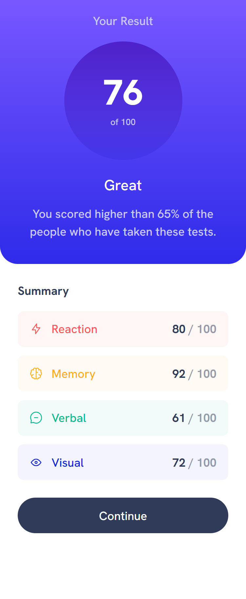
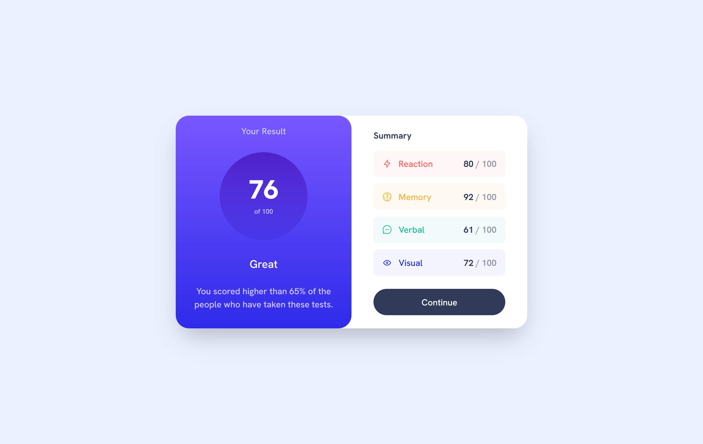

# Frontend Mentor - Results summary component solution

This is a solution to the [Results summary component challenge on Frontend Mentor](https://www.frontendmentor.io/challenges/results-summary-component-CE_K6s0maV). Frontend Mentor challenges help you improve your coding skills by building realistic projects. 

## Table of contents

- [Overview](#overview)
  - [The challenge](#the-challenge)
  - [Screenshot](#screenshot)
  - [Links](#links)
- [My process](#my-process)
  - [Development process](#development-process)
  - [Built with](#built-with)
  - [What I learned](#what-i-learned)
  - [Continued development](#continued-development)
  - [Useful resources](#useful-resources)
- [Author](#author)
- [Acknowledgments](#acknowledgments)


## Overview

### The challenge

Users should be able to:

- View the optimal layout for the interface depending on their device's screen size
- See hover and focus states for all interactive elements on the page
- **Bonus**: Use the local JSON data to dynamically populate the content

### Screenshots

#### Mobile Screenshot

#### Desktop Screenshot


### Links

- Solution URL: [Github Repository](https://github.com/DavidFayemi/Results-summary-component)
- Live Site URL: [Github Pages](https://davidfayemi.github.io/Results-summary-component/public)

## My process

### Development Process
- Arranged Project Folder
- Installed TaliwindCSS
- Updated .gitignore to ignore node modules, design folder, style-guide and .vscode folder for live server
- Added custom font sizes, families and colors to tailwind
- Styled the mobile view with tailwind utility classes
- Added Responsiveness for tablet screens and larger

### Built with

- Semantic HTML5 markup
- CSS custom properties
- Tailwind-css
- Mobile-first workflow

### What I learned

> Adding Background gradient with tailwind


```html
<div 
  class="w-32 h-32 bg-gradient-to-b from-gradients-circle-violet-blue to-gradients-circle-persian-blue rounded-full flex flex-col items-center justify-center mt-4 mb-2"
>
  <p class="text-5xl font-extrabold mb-2">76</p>
  <p class="text-neutral-light-lavender text-xs">of 100</p>
</div>
```

## Author

- Github - [@DavidFayemi](https://github.com/DavidFayemi)
- Frontend Mentor - [@DavidFayemi](https://www.frontendmentor.io/profile/DavidFayemi)

## Acknowledgments

> All Glory to God